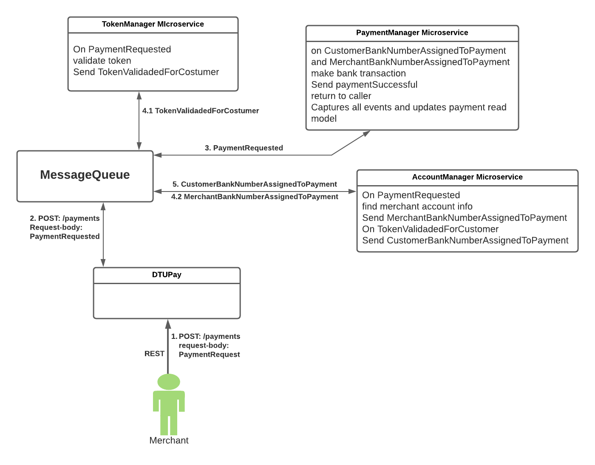

# DtuPay Web Service

## Description
Main group project of the Development of Web Services course. It was about creating several microservices using Docker, REST API utilization and specification, and creation of software tests (REST API, feature using Cucumber, End-To-End).

## Installation

To build, deploy and test the project run
`./build_and_run.sh`

## Scripts
- `./build.sh`
  Packages and installs all modules in the maven local repository. This also runs tests for each microservice.

- `./deploy.sh`
  Deploys all microservices to docker, given that they have already been packaged.

- `./test.sh`
  Runs the end-to-end test.

- `./build_and_run.sh`
  Does all of the above.

## Tools required 
- Java 11 SDK
- Maven
- Docker
- Docker-compose
- Bash

  

